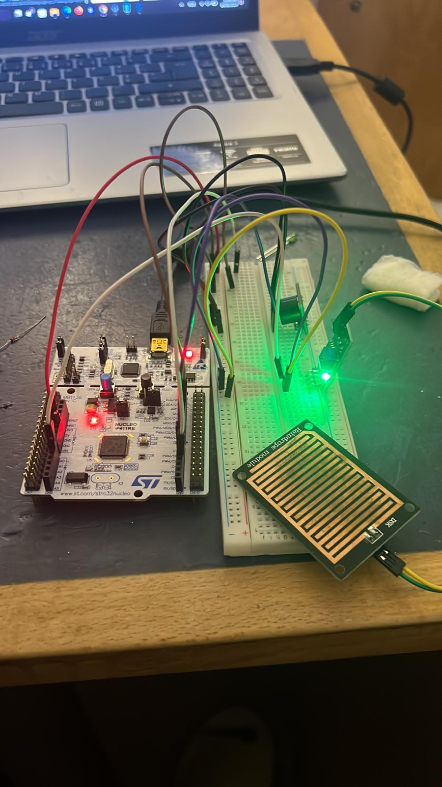

# Water Extraction System — STM32 Nucleo / Mbed OS

An embedded system prototype for automated well water extraction, built on the STM32 Nucleo-F411RE with Mbed OS. The system uses a rain sensor to detect water presence and activates a water pump while providing LED and buzzer status feedback.

Developed for the Microcontrollers and Embedded Systems course 

---

## Table of Contents
- [About the Project](#about-the-project)
- [Features](#features)
- [Hardware](#hardware)
- [Pin Mapping](#pin-mapping)
- [Logic Overview](#logic-overview)
- [Getting Started](#getting-started)
- [File Structure](#file-structure)
- [Authors](#authors)

---

## About the Project

This project implements a simple automated water extraction controller. A resistive rain/water sensor continuously reads the water level on an analog input. When water is detected above a threshold, the system activates a water pump (via a transistor switch), lights the green LED, and triggers the buzzer. When no water is present, the outputs are turned off and the red LED signals the idle state.

The firmware is written in C++ using the Mbed OS API and runs on the STM32 Nucleo-F411RE development board.



---

## Features

- Analog rain/water sensor reading every 1 second
- Configurable detection threshold (default: 0.5 on a 0.0-1.0 normalized scale)
- LED indicator: green when water is detected, red when idle
- Buzzer alert when water detection is active
- Water pump control via NPN transistor switch
- Serial output of sensor value for monitoring and debugging

---

## Hardware

| Component | Description |
|---|---|
| STM32 Nucleo-F411RE | Main microcontroller board (ARM Cortex-M4, 100MHz) |
| Rain/Raindrops Sensor Module | Resistive sensor pad + comparator module; outputs analog voltage |
| Water Pump | DC pump driven via transistor switch |
| NPN Transistor | Switches pump power from digital output (D5 or similar) |
| Green LED | Signals active water detection / pump running |
| Red LED | Signals idle state / no water detected |
| Buzzer | Audible alert when water is detected |
| Breadboard + jumper wires | Prototyping connections |

---

## Pin Mapping

| Nucleo Pin | Signal | Connected To |
|---|---|---|
| `A0` | Analog input | Rain sensor analog output |
| `D4` | Digital output | LED (active HIGH = on) |
| `D5` | Digital output | Buzzer (active HIGH = on) |
| `3.3V / 5V` | Power | Sensor VCC, buzzer VCC |
| `GND` | Ground | All components |

> The water pump is driven through an NPN transistor. Connect the transistor base to a digital output pin, collector to the pump negative terminal, and emitter to GND. The pump positive terminal connects to the external supply.

---

## Logic Overview

The main loop runs continuously with a 1-second sleep between iterations:

```
read rainSensor -> rainValue (0.0 to 1.0)

if rainValue > 0.5:
    LED = ON
    Buzzer = ON
    (pump active via transistor)
else:
    LED = OFF
    Buzzer = OFF
    (pump idle)

print rainValue to serial
sleep 1s
```

The threshold `rainThreshold = 0.5f` can be adjusted in the source code. Values above 0.5 indicate water presence; the sensor produces lower normalized values on a dry surface and higher values when wet (the comparator circuit inverts the relationship on the analog output — verify with your specific module).

> Note: noise variance above ~0.02 on the analog reading may cause false triggers. Ensure stable power supply to the sensor module.

---

## Getting Started

### Requirements
- [Mbed Studio](https://os.mbed.com/studio/) or [Mbed CLI](https://os.mbed.com/docs/mbed-os/latest/build-tools/mbed-cli-1.html)
- STM32 Nucleo-F411RE board
- Mbed OS 6.x

### Build and Flash

Using Mbed Studio:
1. Open Mbed Studio and import the project folder
2. Set the target to `NUCLEO_F411RE`
3. Click Build, then Flash

Using Mbed CLI:
```bash
mbed compile -m NUCLEO_F411RE -t GCC_ARM
cp BUILD/NUCLEO_F411RE/GCC_ARM/project.bin /path/to/Nucleo/drive/
```

### Serial Monitor
Connect via any serial terminal at **9600 baud** to view the sensor readings:
```
Rain value: 0.73
Rain value: 0.71
Rain value: 0.12
```

### Adjusting the Threshold
In `main.cpp`, change the line:
```cpp
const float rainThreshole = 0.5f;
```
Increase the value to require a wetter surface before triggering, or decrease it to trigger earlier.

---

## File Structure

```
water-extraction-system/
├── mbed_Microcontroller_Library.txt   -- Main firmware source (rename to main.cpp)
├── mbedimage.jpeg                     -- Prototype photo 1 (Nucleo + rain sensor)
├── mbedimage2.jpeg                    -- Prototype photo 2 (development setup)
├── mbedimage3.jpeg                    -- Prototype photo 3 (development setup)
├── mbedimage4.jpeg                    -- Prototype photo 4 (full circuit view)
├── mbedvideo.mp4                      -- Demo video of the working prototype
├── sistemaextracaodeagua_micsa.pptx   -- Project presentation slides (Portuguese)
└── README.md
```

---

## Authors

- Edson Come 

